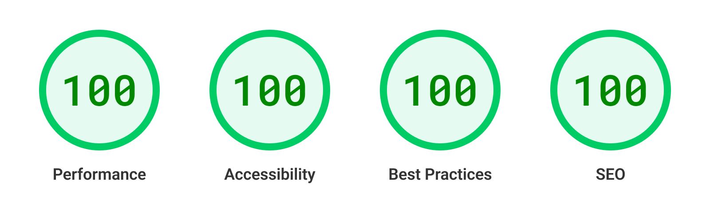

# Eclipse Starter

```bash
npm create astro@latest -- --template Thomas-Zabalo/astro-template
```


Eclipse is a modern web development template built with Astro, MDX, and Tailwind CSS. It is designed for creating elegant and high-performance online portfolios.

## Features

- [x] **Project Showcase**: A dedicated section to showcase various projects with detailed descriptions and attractive visuals.
  
- [x] **Fully Functional Blog**: Includes a blog to share ideas, tutorials, and updates.
  
- [x] **About Section**: Presents your professional profile, skills, and career journey.
  
- [x] **SEO Friendly**: Optimized for search engines to ensure better visibility.

## Technologies Used

- **Astro**: Fast and optimized static site builder.
  
- **MDX**: For easily creating and integrating content.
  
- **Tailwind CSS**: For beautiful and responsive UI design.

[]([https://pagespeed.web.dev/analysis/https-astro-i18n-starter-pages-dev-en/8sg3q21r6c?form_factor=desktop](https://pagespeed.web.dev/analysis/https-astro-template-six-vercel-app/qi7p4tmx7i?form_factor=desktop&category=performance&category=accessibility&category=best-practices&category=seo&hl=fr&utm_source=lh-chrome-ext
) "Check score")

## Installation

To get started with Eclipse, follow these steps:

1. **Clone the repository**:
   ```bash
   git clone https://github.com/Thomas-Zabalo/astro-template.git
   ```

2. **Navigate into the project directory**:
   ```bash
   cd astro-template
   ```

3. **Install dependencies**:
   ```bash
   npm install
   ```

4. **Start the development server**:
   ```bash
   npm run dev
   ```

5. **Open your browser** and navigate to `http://localhost:3000` to view the project.

## Structure

The project structure is organized as follows:

- **`/src`**: Contains all source files for the project.
  - **`/components`**: Reusable UI components.
  - **`/pages`**: Pages of the application.
  - **`/content`**: Content of the application.
  - **`/data`**: Data files such as configuration or constants.
- **`/public`**: Static assets like images and fonts.
- **`/styles`**: Global styles and Tailwind CSS configuration.

## Usage of MDX

MDX is used in Eclipse for creating dynamic content. MDX allows you to write JSX in Markdown documents, making it easy to embed React components alongside Markdown content. Here's how MDX is used:

- **Create MDX files** in the `/src/pages` or `/src/content/*` directories.
- Use Markdown syntax for text formatting.
- Embed React components directly within the Markdown content for interactive elements.

## Contributing

Contributions to Eclipse are welcome! If you have any ideas, improvements, or bug fixes, feel free to fork the repository and submit a pull request. For major changes, please open an issue first to discuss your ideas.

## License

This project is licensed under the MIT License - see the [LICENSE](/path/to/LICENSE) file for details.
